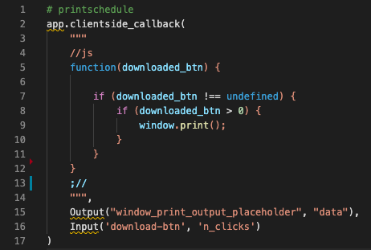

# Javascript highlighting in Python multiline strings for VS Code 

Adds syntax highlight support for python multiline Javascript strings in VS Code.

## Example

## Usage

Insert `//js` at the beginning of the part of the string you would like highlighted and  `;//` at the end of the highlighted section.

### Snippets
begin typing `js` or `sql` and the autocomplete snippet will appear

## Requirements
- Comments at beginning and end of highlighted section in the string (see Usage section).

## Community
- Forked from python-string-sql

## Release Notes
### [0.1.2] - 2021-10-01
- Updated package.json display name and keywords

### [0.0.1] - 2021-09-16
- Published on VS Code marketplace

### [0.0.0] - 2021-09-14

- Forked from python-string-sql
- This is a refocussing of the extension python-string-sql from sql and html to javascript.

